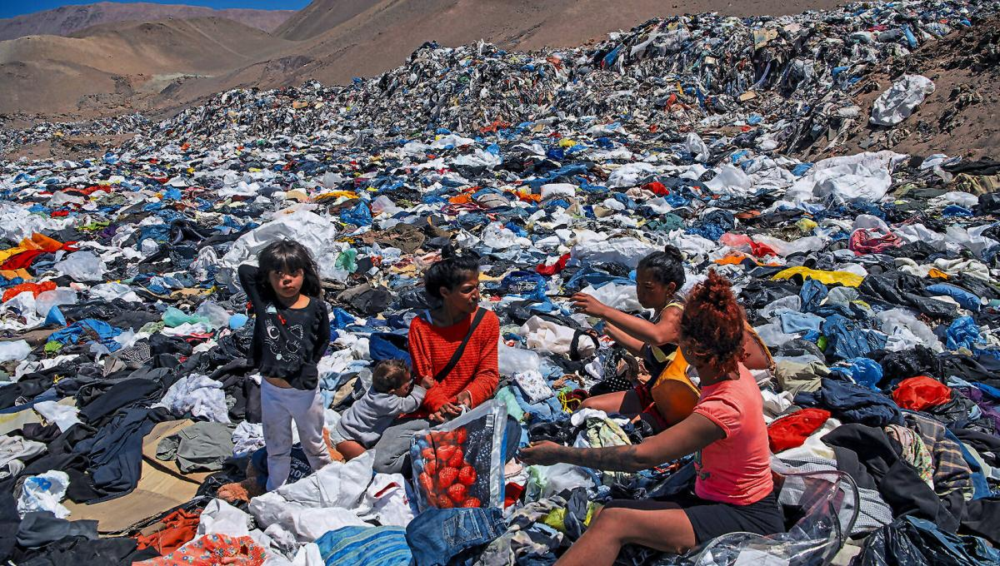

# Tarea 01 - Valentina Rojas

### 1. Fast Fashion: La moda que desviste al planeta

Desde hace un tiempo ha crecido la preocupación global por los impactos de la industria de la moda. Según cifras del Ministerio del Medio Ambiente, en los últimos 20 años Chile se ha convertido en el país de América Latina que consume más ropa por persona, lo que de manera invisible afecta el medio ambiente.

  

Pros: 

- Es posible medir la huella de carbono del fast fashion a través de la medición de emisiones de CO2 generadas por la producción, transporte y venta de ropa de moda rápida en comparación con otros sectores industriales.

- Se podría medir la cantidad de materiales naturales y sintéticos (como algodón, poliéster, etc.) utilizados en la producción de ropa, y cómo esto afecta la biodiversidad, por ejemplo, a través de la deforestación o la destrucción de hábitats naturales.

- Resultaría interesante analizar la vida útil promedio de las prendas de moda rápida y la frecuencia con la que se reemplazan, para así medir la cantidad de ropa desechada por los consumidores y su destino final (vertederos, incineración, reciclaje).

Contras: 

- Las marcas de moda rápida a menudo no son transparentes sobre sus prácticas y datos de producción, y datos sobre emisiones de CO2, uso de agua, y desechos textiles pueden ser inconsistentes debido a que  lo que dificulta la obtención de información precisa.

- La moda rápida involucra múltiples etapas en diferentes países, lo que hace difícil rastrear el impacto en la biodiversidad, como la deforestación o la destrucción de hábitats, los que a menudo son indirectos y pueden estar relacionados con varios factores. 

### 2-  Chile: Donde la lectura resulta un privilegio 

Se expone que Chile es uno de los países de América Latina donde los libros tienen un costo significativamente alto, lo que establece una barrera para el fomento del hábito de la lectura y el acceso al conocimiento.

 

Pros: 

- Es posible investigar la tasa de alfabetización de los chilenos y relacionarla con la tasa de compra anual de libros. 

- Se podría tener acceso a encuestas de opinión sobre la lectura en Chile, hábitos de lectura y gustos literarios. 

- A través de información entregada por el Gobierno sería posible identificar la cantidad de el acceso gratuito a libros y bibliotecas, y programas que fomenten la lectura. 

- Una arista interesante sería analizar cómo la tecnología está cambiando los hábitos de lectura y si esto afecta el acceso a la lectura.

Contras: 

- Aunque es posible obtener datos sobre la tasa de alfabetización, estos pueden no estar actualizados o desagregados por todas las regiones, lo que podría limitar el análisis comparativo.

- Obtener datos gubernamentales sobre el acceso gratuito a libros, bibliotecas y programas de fomento a la lectura puede ser difícil si estos datos no son transparentes o si están dispersos en diferentes organismos gubernamentales. 

### 3- La participación electoral en Chile 

Para el plebiscito de septiembre del 2022 volvió a entrar en vigencia la obligatoriedad del voto en Chile, aunque esta vez, conjugándose ineditamente con un mecanismo de inscripción automática. Como resultado, sufragó 86% de la población en edad de votar, un nivel de participación sólo observado en las primeras elecciones desde la vuelta a la democracia.

 

Pros: 

- A través de datos entregados por el Servel, se podría representar la evolución de la tasa de participación electoral en las elecciones presidenciales, parlamentarias y municipales en Chile desde la restauración de la democracia en 1990, para identificar tendencias. 

- Es posible analizar la tasa de participación electoral por región o comuna en las últimas elecciones, para destacar las regiones con mayor o menor participación y explorar las posibles razones detrás de estas diferencias geográficas. 

- También se podría comparar la participación electoral entre diferentes grupos etarios en las últimas elecciones, para identificar cuáles grupos etarios tienen menor o mayor participación y analizar cómo estos patrones podrían afectar los resultados electorales.

- Sería interesante evaluar cómo el cambio de voto obligatorio a voluntario ha impactado la participación y qué grupos han sido más afectados. 

- Se podría investigar si existen diferencias significativas en la participación electoral según el nivel socioeconómico y qué implicaciones tiene esto para la representación política. 

Contras:

- Aunque el Servel proporciona datos, no siempre están desagregados a nivel de detalle necesario (por comuna, grupo etario, nivel socioeconómico), lo que podría limitar el análisis.

- Determinar los patrones es difícil porque muchos factores (políticos, sociales, económicos) influyen en los patrones observados, lo que dificulta establecer relaciones causales precisas.

- Evaluar el impacto del cambio de voto obligatorio a voluntario es complejo, porque el análisis no se trata sólo de datos, sino también de cambios en las actitudes de los votantes, lo que puede requerir un análisis cualitativo. 

## Matriz impacto x esfuerzo

.jpg) 

### Conclusiones del Miro

**Fast Fashion: La moda que desviste al planeta - Medio impacto/ Medio esfuerzo**

- Este tema resulta de mucho interés desde un tiempo hasta la actualidad debido a la preocupante situación del medio ambiente y de la Tierra. 

- Existen bastantes datos que pueden contribuir a investigar de manera exitosa y eficiente esta problemática, sin embargo es un tema que abarca diversas aristas a en donde algunas pueden resultar más difícil de acceder. 

- En general los temas medioambientales poseen alto impacto, y aunque este en específico pueda tener complicaciones para investigarse resulta un proyecto desafiante. 

**Chile: Donde la lectura resulta un privilegio - Bajo impacto/ Mayor esfuerzo** 

- Esta temática posee un bajo impacto debido a que la lectura y la alfabetización ya no son altas preocupaciones de la población, al menos en Chile. 

- Este tema requiere un mayor esfuerzo de investigación ya que la recopilación de datos puede ser más dificil al no existir alguna entidad específica del problema, si no más bien resulta un mal antiguo. 

**Participación electoral en Chile - Alto impacto/ Menor esfuerzo** 

- Este tema tiene un alto impacto debido al contexto actual, ya que este año y el próximo resultar ser años electorales por lo que es interesante conocer acerca de esto. 

- Respecto al esfuerzo, la recopilación de datos podría resultar más accesible ya que el Servel es una entidad transparente que suele propocionar muchos de los datos que se necesitarían. 

- Este proyecto resulta ser uno de los más convenientes entre los cuadrantes por el gran interés de la población en el tema y la facilidad del reporteo de los datos. 
